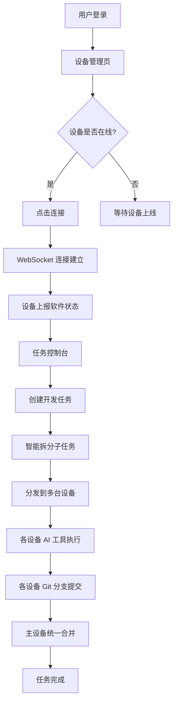
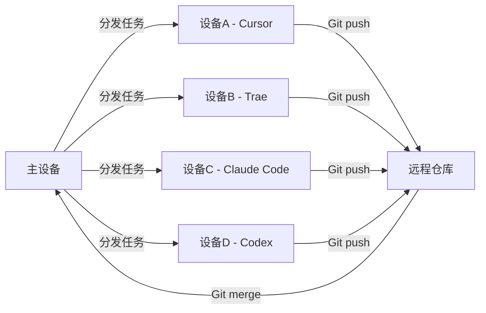

## 1. 产品概述

DevFleet 是一款面向 AI 辅助开发场景的多设备协同控制平台，类似向日葵远程控制但专注于编程软件控制。它允许用户将 AI 开发任务分发到多台设备的四个 AI 编程工具（Codex、Trae、Cursor、Claude Code）上并行执行，最终通过 Git 统一合并提交，大幅提升开发效率。

- 目标用户：使用多种 AI 编程工具进行开发的工程师和团队
- 核心价值：将单机多代理模式升级为多设备并行模式，实现任务分发、状态监控、Git 统一提交的全流程自动化

## 2. 核心功能

### 2.1 用户角色

| 角色 | 注册方式 | 核心权限 |
|------|----------|----------|
| 普通用户 | 邮箱注册 | 管理自己的设备、创建和分发任务 |
| 团队管理员 | 邮箱注册 | 管理团队成员、共享设备池 |

### 2.2 功能模块

1. **登录页**：邮箱登录/注册，极简流程
2. **设备管理页**：设备列表、连接状态、软件状态、一键连接
3. **任务控制台**：任务创建、分发策略、执行监控、Git 合并

### 2.3 页面详情

| 页面名称 | 模块名称 | 功能描述 |
|----------|----------|----------|
| 登录页 | 登录表单 | 邮箱+密码登录，支持注册跳转 |
| 登录页 | 注册表单 | 邮箱+密码注册，注册后自动登录 |
| 设备管理页 | 设备列表 | 展示所有已绑定设备，显示在线/离线状态 |
| 设备管理页 | 设备连接 | 点击连接按钮，建立 WebSocket 连接，显示连接进度 |
| 设备管理页 | 软件状态面板 | 显示每台设备上四个 AI 编程工具的运行状态（运行中/空闲/未安装） |
| 设备管理页 | 添加设备 | 生成设备码，新设备输入设备码绑定 |
| 任务控制台页 | 任务创建 | 输入开发任务描述，选择目标设备和工具 |
| 任务控制台页 | 智能分发 | 根据设备负载和工具可用性自动分配子任务 |
| 任务控制台页 | 执行监控 | 实时显示各设备任务执行进度、日志输出 |
| 任务控制台页 | Git 合并 | 任务完成后自动创建分支、提交代码、发起合并请求 |

## 3. 核心流程

### 3.1 设备连接流程

用户登录后，在设备管理页看到所有已绑定设备。点击"连接"按钮，系统通过 WebSocket 与目标设备建立长连接，设备上的 Agent 客户端上报四个 AI 编程工具的状态信息，主设备实时展示。

### 3.2 任务分发流程

用户在任务控制台创建任务，系统将任务拆分为子任务，根据各设备负载和工具可用性智能分发到不同设备。各设备上的 Agent 接收任务后调用对应的 AI 编程工具执行，执行结果通过 Git 分支管理，最终在主设备统一合并。

## 4. 用户界面设计

### 4.1 设计风格

- **主色调**：深色主题，主色 `#0A0A0B`（近黑），强调色 `#22C55E`（绿色，代表连接/在线状态）
- **次色调**：`#71717A`（zinc-500，辅助文字），`#27272A`（zinc-800，卡片背景）
- **按钮风格**：圆角 `rounded-lg`，主按钮绿色填充，次按钮边框样式
- **字体**：JetBrains Mono（代码/数据展示），系统 sans-serif（正文）
- **布局风格**：侧边栏导航 + 主内容区，卡片式布局
- **图标风格**：Lucide 线性图标，简洁统一
- **整体风格**：参考 FlClash 的简约设计，信息密度适中，留白充足

### 4.2 页面设计概览

| 页面名称 | 模块名称 | UI 元素 |
|----------|----------|---------|
| 登录页 | 登录表单 | 居中卡片，深色背景，绿色登录按钮，输入框带图标 |
| 设备管理页 | 设备列表 | 左侧侧边栏导航，右侧设备卡片网格，每张卡片显示设备名、状态指示灯、四个工具状态图标 |
| 设备管理页 | 软件状态面板 | 四个工具图标横排，每个下方显示状态文字（运行中/空闲/未安装），绿色/灰色/红色状态色 |
| 任务控制台页 | 任务创建 | 顶部输入区域，文本框输入任务描述，下方设备选择器 |
| 任务控制台页 | 执行监控 | 卡片列表，每张卡片显示设备名、工具名、进度条、实时日志滚动区域 |
| 任务控制台页 | Git 合并 | 合并状态卡片，显示各分支提交记录，合并按钮 |

### 4.3 响应式设计

- 桌面优先设计，最小宽度 1024px
- 侧边栏在移动端折叠为汉堡菜单
- 设备卡片网格自适应列数

### 4.4 动效设计

- 设备连接时状态指示灯脉冲动画
- 任务执行时进度条平滑过渡
- 页面切换淡入淡出
- 日志区域自动滚动到底部
