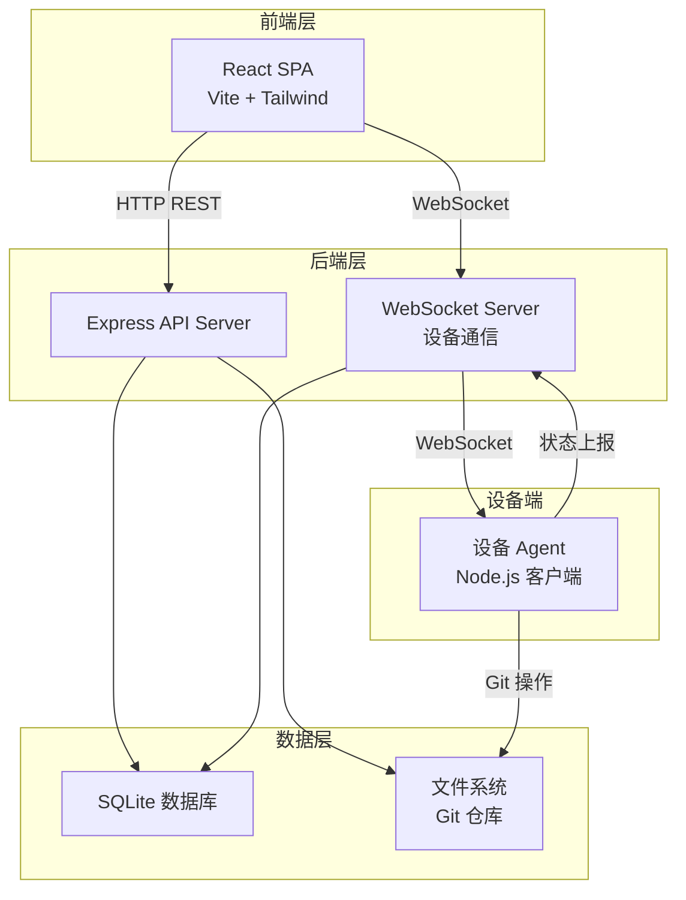
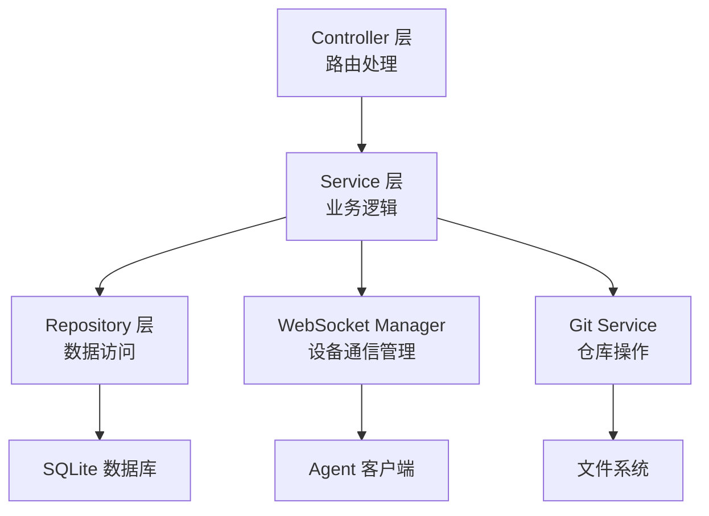
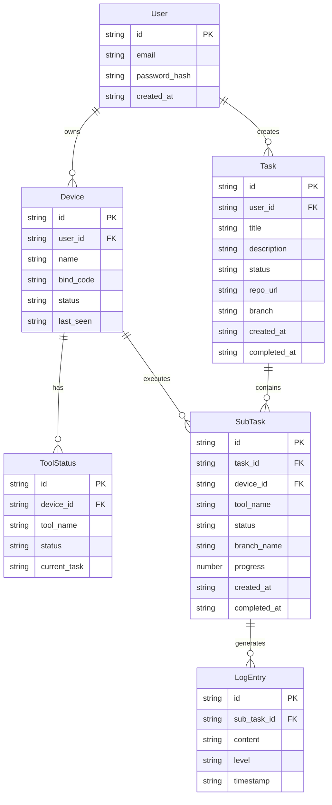

## 1. 架构设计



## 2. 技术说明

- **前端**：React@18 + TailwindCSS@3 + Vite + Zustand
- **初始化工具**：vite-init（react-express-ts 模板）
- **后端**：Express@4 + TypeScript（ESM）
- **数据库**：SQLite（better-sqlite3），轻量级嵌入式数据库
- **实时通信**：ws（WebSocket 库）
- **设备端 Agent**：Node.js 客户端脚本，通过 WebSocket 与服务端通信

## 3. 路由定义

| 路由 | 用途 |
|------|------|
| `/login` | 登录/注册页面 |
| `/devices` | 设备管理页面 |
| `/tasks` | 任务控制台页面 |
| `/tasks/:id` | 任务详情页面 |

## 4. API 定义

### 4.1 认证相关

```typescript
// POST /api/auth/register
interface RegisterRequest {
  email: string;
  password: string;
}
interface RegisterResponse {
  token: string;
  user: { id: string; email: string };
}

// POST /api/auth/login
interface LoginRequest {
  email: string;
  password: string;
}
interface LoginResponse {
  token: string;
  user: { id: string; email: string };
}
```

### 4.2 设备管理

```typescript
// GET /api/devices - 获取设备列表
interface Device {
  id: string;
  name: string;
  status: "online" | "offline" | "connecting";
  tools: ToolStatus[];
  lastSeen: string;
  bindCode?: string;
}
interface ToolStatus {
  name: "codex" | "trae" | "cursor" | "claude_code";
  status: "running" | "idle" | "not_installed";
  currentTask?: string;
}

// POST /api/devices/bind - 生成绑定码
interface BindDeviceRequest {
  deviceName: string;
}
interface BindDeviceResponse {
  bindCode: string;
  expiresIn: number;
}

// POST /api/devices/:id/connect - 连接设备
interface ConnectDeviceResponse {
  success: boolean;
  message: string;
}

// DELETE /api/devices/:id - 移除设备
```

### 4.3 任务管理

```typescript
// POST /api/tasks - 创建任务
interface CreateTaskRequest {
  title: string;
  description: string;
  targetDevices: string[];  // 设备 ID 列表
  targetTools: string[];    // 工具名称列表
  repoUrl: string;          // Git 仓库地址
  branch: string;           // 目标分支
}
interface CreateTaskResponse {
  task: Task;
  subTasks: SubTask[];
}

// GET /api/tasks - 获取任务列表
interface Task {
  id: string;
  title: string;
  description: string;
  status: "pending" | "running" | "completed" | "failed";
  subTasks: SubTask[];
  createdAt: string;
  completedAt?: string;
  repoUrl: string;
  branch: string;
}

// GET /api/tasks/:id - 获取任务详情
interface SubTask {
  id: string;
  taskId: string;
  deviceId: string;
  tool: "codex" | "trae" | "cursor" | "claude_code";
  status: "pending" | "running" | "completed" | "failed";
  branchName: string;
  progress: number;
  logs: LogEntry[];
}

// POST /api/tasks/:id/merge - 合并子任务分支
interface MergeTaskRequest {
  commitMessage: string;
}
interface MergeTaskResponse {
  success: boolean;
  mergeCommitSha: string;
}

// WebSocket 消息类型
interface WSMessage {
  type: "device_status" | "task_progress" | "task_log" | "task_completed";
  payload: Record<string, unknown>;
}
```

## 5. 服务端架构图



## 6. 数据模型

### 6.1 数据模型定义



### 6.2 数据定义语言

```sql
CREATE TABLE users (
  id TEXT PRIMARY KEY DEFAULT (lower(hex(randomblob(16)))),
  email TEXT UNIQUE NOT NULL,
  password_hash TEXT NOT NULL,
  created_at TEXT DEFAULT (datetime('now'))
);

CREATE TABLE devices (
  id TEXT PRIMARY KEY DEFAULT (lower(hex(randomblob(16)))),
  user_id TEXT NOT NULL REFERENCES users(id) ON DELETE CASCADE,
  name TEXT NOT NULL,
  bind_code TEXT UNIQUE,
  status TEXT DEFAULT 'offline' CHECK(status IN ('online', 'offline', 'connecting')),
  last_seen TEXT DEFAULT (datetime('now'))
);

CREATE TABLE tool_statuses (
  id TEXT PRIMARY KEY DEFAULT (lower(hex(randomblob(16)))),
  device_id TEXT NOT NULL REFERENCES devices(id) ON DELETE CASCADE,
  tool_name TEXT NOT NULL CHECK(tool_name IN ('codex', 'trae', 'cursor', 'claude_code')),
  status TEXT DEFAULT 'not_installed' CHECK(status IN ('running', 'idle', 'not_installed')),
  current_task TEXT,
  UNIQUE(device_id, tool_name)
);

CREATE TABLE tasks (
  id TEXT PRIMARY KEY DEFAULT (lower(hex(randomblob(16)))),
  user_id TEXT NOT NULL REFERENCES users(id) ON DELETE CASCADE,
  title TEXT NOT NULL,
  description TEXT NOT NULL,
  status TEXT DEFAULT 'pending' CHECK(status IN ('pending', 'running', 'completed', 'failed')),
  repo_url TEXT NOT NULL,
  branch TEXT NOT NULL DEFAULT 'main',
  created_at TEXT DEFAULT (datetime('now')),
  completed_at TEXT
);

CREATE TABLE sub_tasks (
  id TEXT PRIMARY KEY DEFAULT (lower(hex(randomblob(16)))),
  task_id TEXT NOT NULL REFERENCES tasks(id) ON DELETE CASCADE,
  device_id TEXT NOT NULL REFERENCES devices(id) ON DELETE CASCADE,
  tool_name TEXT NOT NULL CHECK(tool_name IN ('codex', 'trae', 'cursor', 'claude_code')),
  status TEXT DEFAULT 'pending' CHECK(status IN ('pending', 'running', 'completed', 'failed')),
  branch_name TEXT,
  progress INTEGER DEFAULT 0,
  created_at TEXT DEFAULT (datetime('now')),
  completed_at TEXT
);

CREATE TABLE log_entries (
  id TEXT PRIMARY KEY DEFAULT (lower(hex(randomblob(16)))),
  sub_task_id TEXT NOT NULL REFERENCES sub_tasks(id) ON DELETE CASCADE,
  content TEXT NOT NULL,
  level TEXT DEFAULT 'info' CHECK(level IN ('info', 'warn', 'error', 'debug')),
  timestamp TEXT DEFAULT (datetime('now'))
);

CREATE INDEX idx_devices_user_id ON devices(user_id);
CREATE INDEX idx_tool_statuses_device_id ON tool_statuses(device_id);
CREATE INDEX idx_tasks_user_id ON tasks(user_id);
CREATE INDEX idx_sub_tasks_task_id ON sub_tasks(task_id);
CREATE INDEX idx_sub_tasks_device_id ON sub_tasks(device_id);
CREATE INDEX idx_log_entries_sub_task_id ON log_entries(sub_task_id);
```
